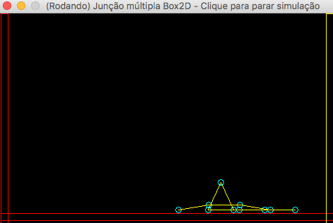

# graphicplay

2D and 3D demos and techniques from my books! I hope you enjoy it!

## Java / Box2D game and animation samples

These are Simple game actions implemented in Java using Box2D library. Here you'll find: Bodies, Forces, Collisions, Joints, Rotation and so on.

Have fun!

## How to run the examples: 

1. You need to have Java installed (at least version 1.6);
2. You need to open a Terminal window (or Console Window);
3. You need to run each sample using the following commands.

Every animation starts with a mouse click. In some of them, you'll need to hit spacebar to fire an action.

## The falling ball

A simple physics demo with a falling ball.


How to run it: 
```
cd JBox2DLab/JBox2DLab/bin
java -cp ./:../lib/jbox2d-library-2.1.2.2-jar-with-dependencies.jar:../lib/slf4j-simple-1.7.2.jar com.obomprogramador.games.box2dlab.LabMain
```

## Simple force demo

Applying force to an object. Click on the window and press SPACE to apply force.


How to run it: 
```
cd ForcaSimplesBox2D/ForcaSimplesBox2D/bin
java -cp ./:../lib/jbox2d-library-2.1.2.2-jar-with-dependencies.jar:../lib/slf4j-simple-1.7.2.jar com.obomprogramador.games.box2dlab.ForcaSimplesMain
```

## Collision detection

A simple collision detection. Press SPACE to apply force to the ball.


How to run it: 
```
cd ContactBox2D/ContactBox2D/bin
java -cp ./:../lib/jbox2d-library-2.1.2.2-jar-with-dependencies.jar:../lib/slf4j-simple-1.7.2.jar com.obomprogramador.games.contact.Contact
```

## Dynamic bodies demo

A scene with some dynamic and static bodies moving. 


```
cd CorposBox2D/CorposBox2D/bin
java -cp ./:../lib/jbox2d-library-2.1.2.2-jar-with-dependencies.jar:../lib/slf4j-simple-1.7.2.jar com.obomprogramador.games.corposbox2d.CorposMain
```

## Applying force to a ball

A scene which you can apply force to a ball. Press SPACE to apply force.


How to run it: 
```
cd ForceBox2D/ForceBox2D/bin
java -cp ./:../lib/jbox2d-library-2.1.2.2-jar-with-dependencies.jar:../lib/slf4j-simple-1.7.2.jar com.obomprogramador.games.box2dlab.ForceMain
```

## Applying force and torque to boxes

A scene which you can apply force and torque to some boxes. Press SPACE to apply.


How to run it: 
```
cd ImpulseTorque/ImpulseTorque/bin
java -cp ./:../lib/jbox2d-library-2.1.2.2-jar-with-dependencies.jar:../lib/slf4j-simple-1.7.2.jar com.obomprogramador.games.impulseForce.ImpulseTorque
```

## Applying torque and force to an image

A simple demo with an image. Press SPACE to apply force and torque.


How to run it: 
```
cd ImageRotation/ImageRotation/bin
java -cp ./:../lib/jbox2d-library-2.1.2.2-jar-with-dependencies.jar:../lib/slf4j-simple-1.7.2.jar com.obomprogramador.games.imagerotationbox2d.Cenario
```

## A simple joint demo

A joint between two dynamic objects. Press SPACE to apply force.


How to run it: 
```
cd SimpleJoint/SimpleJointBox2D/bin
java -cp ./:../lib/jbox2d-library-2.1.2.2-jar-with-dependencies.jar:../lib/slf4j-simple-1.7.2.jar com.obomprogramador.games.simplejoint.SimpleJoint
```

## Collision to a weld joint object

A collision demo to a weld-jointed object. Press SPACE to throw the ball.


How to run it: 
```
cd WeldJoint/WeldJoint/bin
java -cp ./:../lib/jbox2d-library-2.1.2.2-jar-with-dependencies.jar:../lib/slf4j-simple-1.7.2.jar com.obomprogramador.games.weldjoint.WeldJoint
```

## A worm joint demo

A simple object with worm joints. Press SPACE to apply force.



How to run it: 
```
cd WormJoint/WormJoint/bin
java -cp ./:../lib/jbox2d-library-2.1.2.2-jar-with-dependencies.jar:../lib/slf4j-simple-1.7.2.jar com.obomprogramador.games.wormjoint.WormJoint
```

