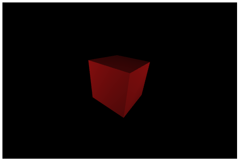
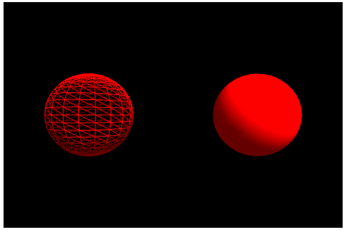
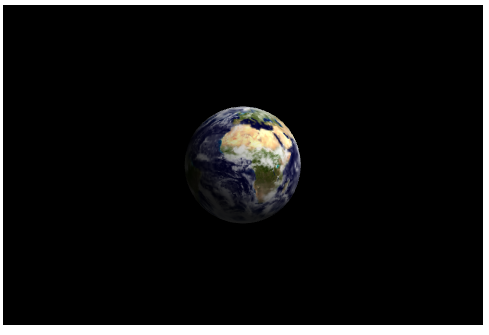

# Simple WebGL Javascript demo

Realistic 3D models using Javascript and WebGL! They are from my game: "Hidden Planet", which I hope to publish some day...

This folder contains WebGL samples. If you want to run them, make sure you use Firefox, because Google Chrome has security locks that prevents read files in file:// mode. If you want, you can download a simple Web Server, like: Apache, Tomcat or NGix and serve the pages from it. 

## 3d with light and shading rotating cube

## Wireframe and filled spheres

## Rotating and shaded Earth!
